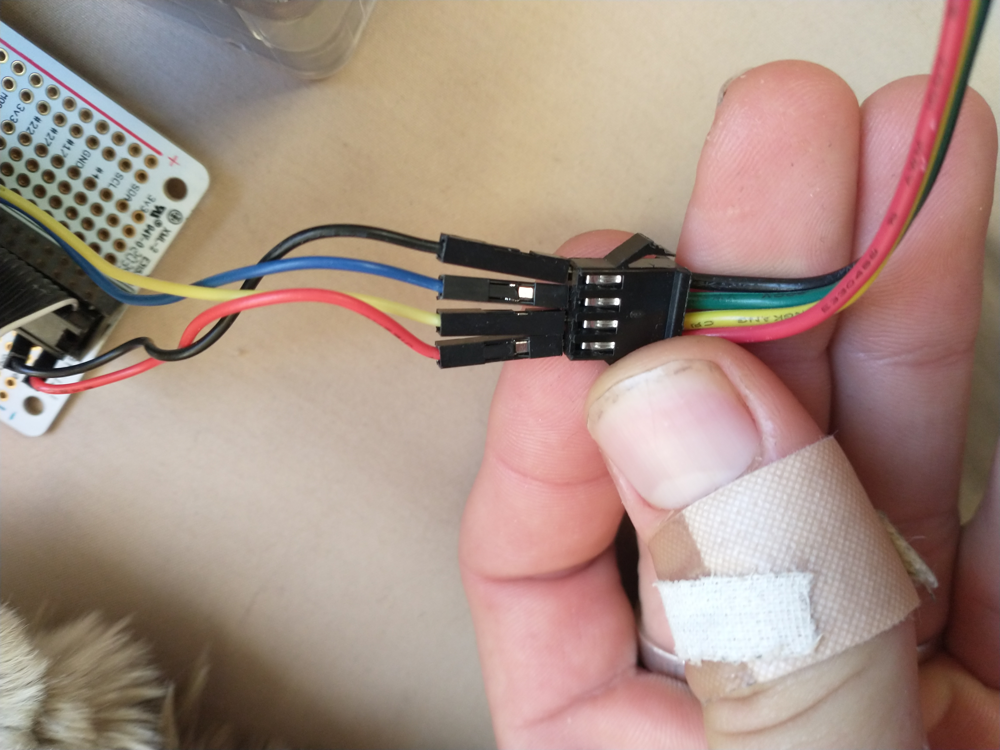
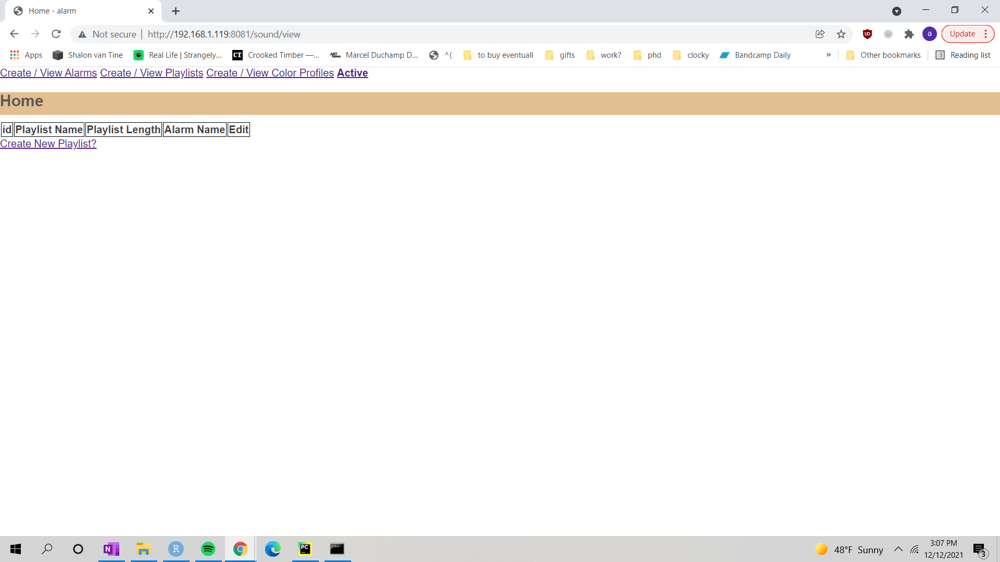
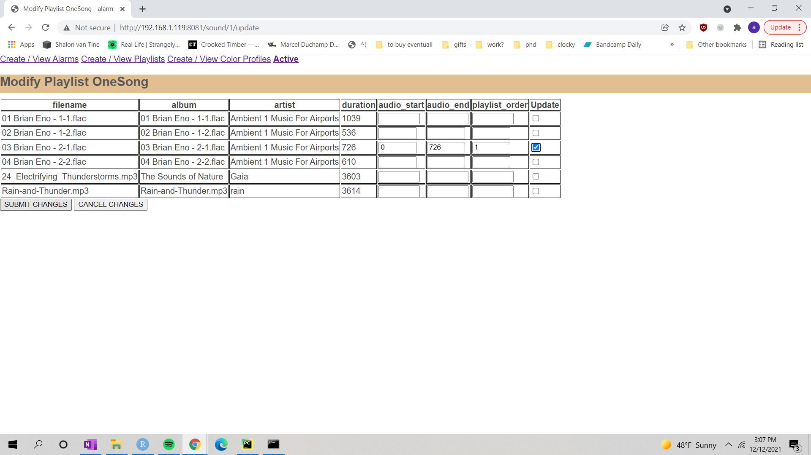
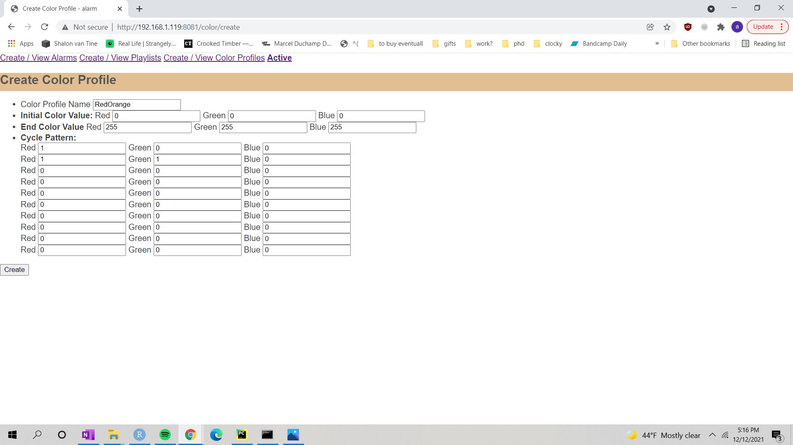
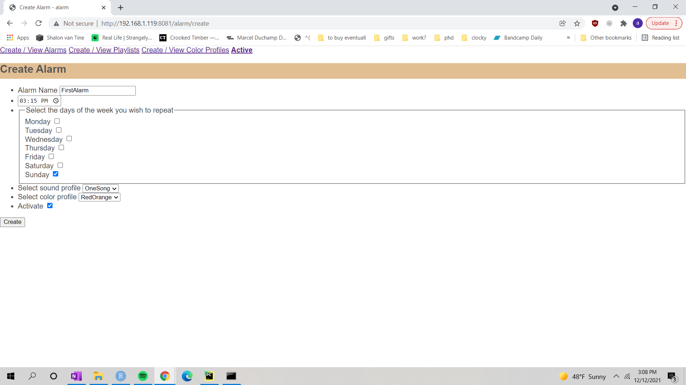

# YARPAC: (Yet Another) Raspberry Pi Alarm Clock 


## Abstract

Instructions for a hardware lite / software heavy Rasbperry Pi alarm clock, using Dotstar LEDs and an external speaker
to wake you up. 

## Introduction

Do you want a physical alarm clock (beyond just your phone) that you can interface with using your phone? 
Are you tired of waking up only to the blaring sound of an alarm, instead of a more organic gradual rise? 
Would you like an alarm clock which uses both light and audio to gently raise you from dream land to wakefulness, 
where the first thing you think is not 'I hate my alarm'?

Well if you also dabble in software and hardware (an educated guess, considering you are reading this), perhaps
you will like this Raspberry Pi Alarm clock project! If you are familiar with flask and raspberry pis this should not
be too much of a lift. 

[This repository](https://github.com/follperson/smart-alarm-clock) will set you up with the primary software drivers 
to implement this. 

### Agenda 

This article will loosely document the primary steps in this project. 

1. Explore at the hardware requirements and softwares used.
2. Hardware setup
2. High level code and software setup
3. Usage and high level configurations
4. Improvements
5. References

## Getting Started

### Hardware and Software Overview

This project runs off of a Raspberry Pi, I used a Raspberry Pi 3B+, but certainly more recent versions will work, and
older ones will probably too, if you have Wifi card. The Raspberry Pi Zero will not because there are not enough usb ports. 

The software is here in this repository, but the functionality is enabled by: the *flask* microframework for Python 
for remote interfacing, the *PyAudio* (link) python bindings for LibAudio, *PyDub* (link) for manipulating raw audio, 
Adafruit Dotstar bindings, and google voice to speech (link). 

#### Hardware Requirements

1. [Raspberry Pi](https://www.raspberrypi.org/) (3b+) or newer
1. [Adafruit Dotstars](https://learn.adafruit.com/adafruit-dotstar-leds) (>= 1 yard) 
    - [Power Source](https://www.adafruit.com/product/1466) if you are using more than 1 yard
2. [USB Speaker](https://www.adafruit.com/product/3369)
2. [Breadboard](https://www.adafruit.com/product/64)
2. [rpi GPIO to Breadboard](https://www.adafruit.com/product/4353)    
3. soldering iron 
4. peripherals:
    - HDMI based monitor
    - USB keyboard
    - USB Mouse
    - Wifi + Router
    - Phone or other device connected to wifi to drive it
    
#### Primary Packages / versions

- Python 3.6
- Miniconda
- Audio managment
   - pyaudio
   - pydub
   - ffmpeg
- Web server
  - flask
- led/gpio
  - circuit-python
- misc 
  - numpy
  - pandas

### Pre-RPI Alarm clock Setup

- Raspberry Pi with a SD card imaged with the Raspian OS.
- Google developers account with text to speech enabled. 
   - Create a file named 'google_key.txt' in the root directory of this repo with the google key.
- Miniconda, ffmpeg, and libaudio installed on the raspberry pi (see [Notes](#misc-support-notes))
- SPI, SSH enabled

## Setup

### Hardware Setup

Before jumping into the software, you will need to connect the USB Audio into one of the USB ports. Then, you will need to
connect to the dotstars. I connected the Rpi MOSI GPIO pin to the DO/DI (digital) wire on the dotstar strip, and the SCLK/clock pin 
to the CO/CI (clock) wire on the dotstar strip. In addition, you need to connect the red power line and black ground line
to the raspberry pi. If you are powering more than 30 dotstars, you will also need to connect the second set of power
and ground wires to the separate power. 

See the following photos for reference.


See [wiring references](#wiring) for more detail.  




First, you need to clone this repo on your machine, create and activate the environment. Once active in the environment,
run `python run-tests.py` to verify everything is working. If one of the pieces is not working, but the others do work, 
then the system will still run with the working components and silently pass by the failing ones.

Second, you will want to add some audio of your own to the repo under `assets/sounds`. You will want to choose short or compressed versions of songs,
as Raspberry pi is only 32 bit, and pyaudio can not accommodate much larger audio files. However, you will be able to string songs
along as in a playlist. 

Third, you can initialize the project with flask. First you will need to register the app to the flask environmental variable. Note: You should
also make sure the system command `flask` is registerd to your current conda environment. If the system flask is running instead of the 
environmental flask, you may need to relace the command `flask` with the path to the environment's version. 

```
export FLASK_APP=smart_alarm
export FLASK_ENV=development
export FLASK_RUN_RELOAD=False
flask init-db
```

After running this command successfully, you will be presented with a wall of logs from registering the audio to the 
database. If this worked successfully, you are ready to start running!

### Set to run automatically on reboot

We need to register the flask app to be run by the system on reboot. 
We do this by editing the local `systemmd` file in repository root 
with the any paths. Once it's been updated:

1) Copy systemmd file to the system pickup location,
    - `sudo cp systemmd /etc/systemd/system/smartalarm.service`
2) Reset the systemctl daemon
   - `sudo systemctl daemon-reload`
3) enable the service
   - `sudo systemctl enable smartalarm`
4) and start the service
   - `sudo systemctl start smartalarm`
5) Check to make sure it is running
   - `sudo systemctl is-active smartalarm`
6) and reboot
    - `sudo reboot`
    
You can review the logs using commands like: 
`systemctl status smartalarm.service` and 
`journalctl smartalarm.service`


## Usage

Now you are ready to run the smart alarm! 

Run it with `flask run --host=0.0.0.0 --port=8081`. This will expose the smart-alarm webpage to any devices on your wifi.

If you know the local IP Address of the rpi, then you can access the service remotely via \<rpi-ip-address>:8081. You can also access it 
locally at localhost:8081 if you still have the monitor connected. 


### Alarm creation

Using the software is fairly simple. 

First, you must create a 'playlist' - the audio component of the alarm,
and a 'color profile' - the LED profile of the alarm.

Once at the landing index, you navigate to 'Create / View Playlist' 
to create a playlist. 



Choose the audio files, the starting and ending time, and set the order. You can have half of one song lead into half of another,
or any sort of song-splicing combinations. 



Next, navigate to 'Create / View Color Profile', to create a color profile. 
Start the process the same way as before, but create the profile by specifying 
starting and ending color values. In addition, you can specify the color update schedule, 
which represents the period-wise color updates. 



Once we've set our initial parameters, we can set an alarm.




Now your alarm is all set!

When alarm is active, you can Snooze, Cancel, Skip-Songs, Mute-audio, or Mute-colors.

Now you should have a dynamic alarm clock! 

## Misc support notes: 

To get portaudio 
- error: portaudio.h: No such file or directory
- solve: `sudo apt-get install portaudio19-dev`

To get hardware spi working:
- https://www.raspberrypi-spy.co.uk/2014/08/enabling-the-spi-interface-on-the-raspberry-pi/

Conda on raspberry pi
- https://gist.github.com/simoncos/a7ce35babeaf73f512be24135c0fbafb

### Wiring
- https://cdn-learn.adafruit.com/assets/assets/000/063/404/medium640/led_strips_raspi_DotStar_SPI_bb.jpg?1539274090
- https://learn.adafruit.com/adafruit-dotstar-leds/python-circuitpython
